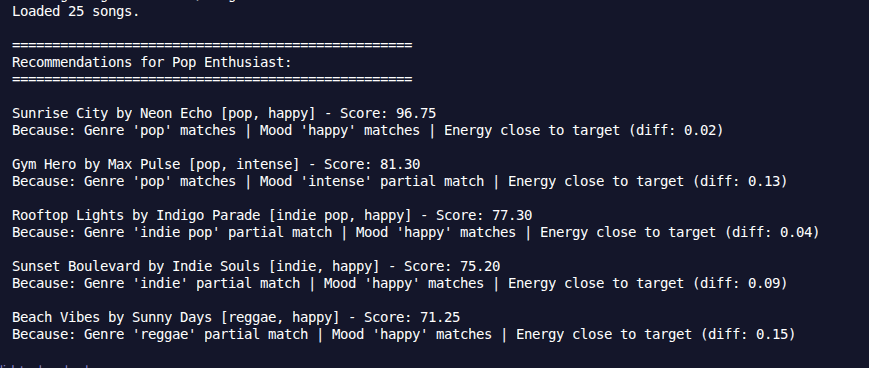
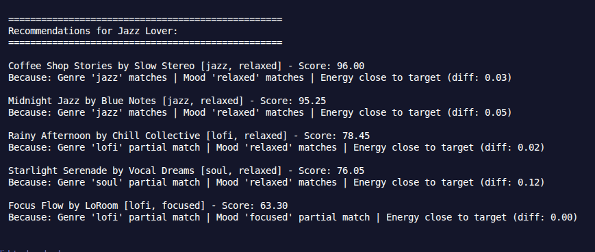
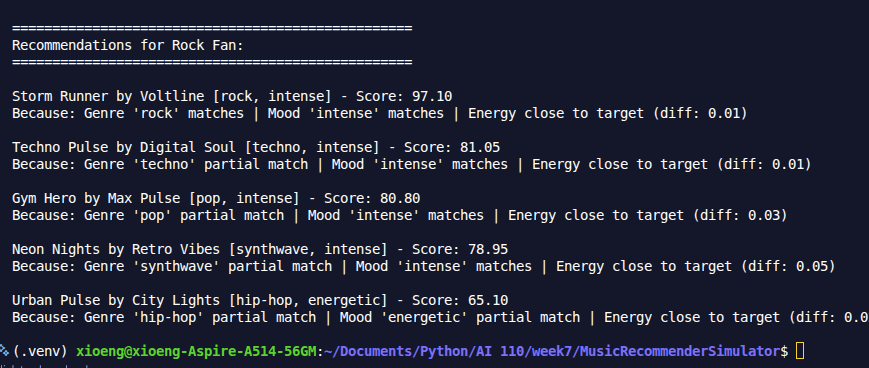
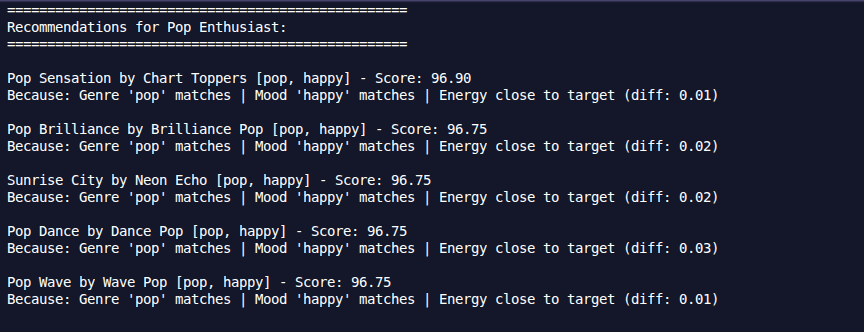
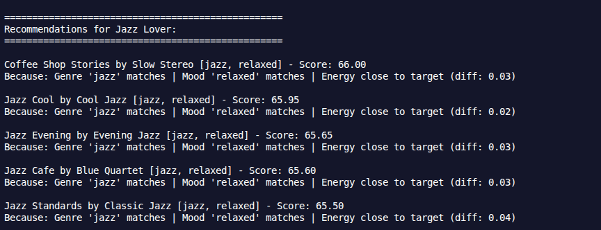

# 🎵 Music Recommender Simulation

## Project Summary

In this project you will build and explain a small music recommender system.

Your goal is to:

- Represent songs and a user "taste profile" as data
- Design a scoring rule that turns that data into recommendations
- Evaluate what your system gets right and wrong
- Reflect on how this mirrors real world AI recommenders

Replace this paragraph with your own summary of what your version does.

---

## How The System Works

Essentially, the system will create a `UserProfile` that captures a user's music preferences, and then compute a score for each `Song` in the catalog based on how well it matches the user's profile. The songs with the highest scores will be recommended. The 'Recommender' class will handle the logic for computing these scores and selecting the top recommendations.
In this case, `UserProfile` might include preferences for genre, mood, energy level, and tempo and probably a list of songs.

So far the features to be used will be
- Genre
- Mood
- Energy
- Danceability
- Acousticness
- Tempo

### Scoring Logic
Let:

- $s$ = a song
- $u$ = a user profile

Define:

- $G(s, u)$: 1 if the song’s genre matches the user’s - favorite genre, otherwise 0.5
- $M(s, u)$: 1 if the song’s mood matches the user’s favorite mood, otherwise 0.5
- $E(s, u)$: 1 minus the absolute difference between the song’s energy and the user’s target energy, capped at a maximum penalty of 0.5 (so: $E(s, u) = 1 - \min(|s_{energy} - u_{energy}|, 0.5)$)
- $A(s, u)$: If the user likes acoustic, use the song’s acousticness value; otherwise, use 1 minus the song’s acousticness value
- $D(s)$: The song’s danceability value

The final score is:

$Score(s, u) = 100 × [
0.35 × G(s, u) +
0.30 × M(s, u) +
0.20 × E(s, u) +
0.10 × A(s, u) +
0.05 × D(s)
]$

### Scoring FLow
                         INPUT
                           |
                           v
                  User Preferences
              (Genre, Artists, Tempo, etc.)
                           |
                           v
                  Load Songs from CSV
                           |
                           v
                 Initialize Scores List
                           |
                           v
        ==========================================
        |   FOR EACH SONG IN CSV                |
        |                                        |
        |   1. Extract Song Features             |
        |      (Genre, Artist, Tempo, etc.)      |
        |                                        |
        |   2. Apply Scoring Logic               |
        |      Match Against User Preferences    |
        |                                        |
        |   3. Calculate Match Score             |
        |      0-100 Points                      |
        |                                        |
        |   4. Add Score to List                 |
        |                                        |
        ==========================================
                           |
                           v
                 Sort Songs by Score
                  (Descending Order)
                           |
                           v
              Filter Top K Songs
           (K = Number of Recommendations)
                           |
                           v
         Generate Recommendation List
                 (With Match Scores)
                           |
                           v
                        OUTPUT
                           |
          Top K Recommendations Ranked
            by Match Score (Best to Worst)


## Getting Started

### Setup

1. Create a virtual environment (optional but recommended):

   ```bash
   python -m venv .venv
   source .venv/bin/activate      # Mac or Linux
   .venv\Scripts\activate         # Windows

2. Install dependencies

```bash
pip install -r requirements.txt
```

3. Run the app:

```bash
python -m src.main
```

### Running Tests

Run the starter tests with:

```bash
pytest
```

You can add more tests in `tests/test_recommender.py`.

---

## Experiments You Tried

### Multiple User Profiles

I performed some tests with different user profiles to see how the recommendations changed. In this case, I used three different user profiles one that liked jazz music, one that liked pop music, and one that liked rock music. As expected, the jazz lover got mostly jazz songs recommended, the pop lover got mostly pop songs, and the rock lover got mostly rock songs. However, there were some cross-genre recommendations that added variety to each user's list.







Nevertheless, when the song list is increased, the system tends to recommend highly and mainly songs from the genre that the user prefers, which can lead to a lack of diversity in the recommendations.



### Changing Weights 

We might agree that the most important factor in a music recommendation is genre. However, it seems that genre is also correlated to other factors; decreasing it might not lead to more diverse recommendations. I changed from 0.35 to 0.05 the weight of genre, yet the recommended songs were still mostly from the user's preferred genre. 




---

## Limitations and Risks

Summarize some limitations of your recommender.

In a tiny catalog the system can only recommend songs that are somewhat similar to the user's preferences, and seem to be diverse. However, in a larger catalog, the system tends to recommend songs that are very similar to the user's preferences, which can lead to a lack of diversity in the recommendations. This is basically a form of overfitting to the user's preferences, and the abundance of songs makes it more likely that the system will find songs that are very similar to the user's preferences.

Also, the system does not consider any user history or feedback, which means that it cannot learn from the user's interactions with the recommendations. To score better the category fields, there should be any sense of similarity between genres. For example, if a user likes jazz, it would make sense to recommend songs from genres that are similar to jazz, such as blues or soul. In the same fashion, if a user likes high energy songs, it would make sense to recommend songs that are also high energy, even if they are not in the same genre.

---

## Reflection

Read and complete `model_card.md`:

[**Model Card**](model_card.md)

Write 1 to 2 paragraphs here about what you learned:

- about how recommenders turn data into predictions
- about where bias or unfairness could show up in systems like this


---

## 7. `model_card_template.md`

Combines reflection and model card framing from the Module 3 guidance. :contentReference[oaicite:2]{index=2}  

```markdown
# 🎧 Model Card - Music Recommender Simulation

## 1. Model Name

Give your recommender a name, for example:

> VibeFinder 1.0

---

## 2. Intended Use

- What is this system trying to do
- Who is it for

Example:

> This model suggests 3 to 5 songs from a small catalog based on a user's preferred genre, mood, and energy level. It is for classroom exploration only, not for real users.

---

## 3. How It Works (Short Explanation)

Describe your scoring logic in plain language.

- What features of each song does it consider
- What information about the user does it use
- How does it turn those into a number

Try to avoid code in this section, treat it like an explanation to a non programmer.

---

## 4. Data

Describe your dataset.

- How many songs are in `data/songs.csv`
- Did you add or remove any songs
- What kinds of genres or moods are represented
- Whose taste does this data mostly reflect

---

## 5. Strengths

Where does your recommender work well

You can think about:
- Situations where the top results "felt right"
- Particular user profiles it served well
- Simplicity or transparency benefits

---

## 6. Limitations and Bias

Where does your recommender struggle

Some prompts:
- Does it ignore some genres or moods
- Does it treat all users as if they have the same taste shape
- Is it biased toward high energy or one genre by default
- How could this be unfair if used in a real product

---

## 7. Evaluation

How did you check your system

Examples:
- You tried multiple user profiles and wrote down whether the results matched your expectations
- You compared your simulation to what a real app like Spotify or YouTube tends to recommend
- You wrote tests for your scoring logic

You do not need a numeric metric, but if you used one, explain what it measures.

---

## 8. Future Work

If you had more time, how would you improve this recommender

Examples:

- Add support for multiple users and "group vibe" recommendations
- Balance diversity of songs instead of always picking the closest match
- Use more features, like tempo ranges or lyric themes

---

## 9. Personal Reflection

A few sentences about what you learned:

- What surprised you about how your system behaved
- How did building this change how you think about real music recommenders
- Where do you think human judgment still matters, even if the model seems "smart"

